<style>
.level1 {
    word-wrap: break-word;
    overflow-wrap: break-word;
}

.page-columns .content {
  margin-left: calc(-45% + 1rem);
  margin-right: 3em;
}

#quarto-content {
  margin-left: calc(20% + 2rem);
}


iframe {
    margin-bottom: -3em;
}

body {
        font-family: 'Times New Roman', Times, serif;
        text-align: justify;
        font-size: 20;
    }
    
    
.figure {
    display: block;
}    


.scrolling-gallery {
    display: flex;
    overflow-x: auto;
    white-space: nowrap;
}

.scrolling-gallery img {
    margin-right: 10px;
    vertical-align: middle;
}


</style>

This is the online version of our report for INFO5000 Coursework. This report includes the basic structure and key findings of our study, which are:

- An interactive plot that identifies locations of emergency stations providing feminine hygiene products in Guangzhou, Shenzhen, Foshan, and Dongguan.
- Some survey results and analysis.

For more detailed information and in-depth analysis, please refer to our full report [here on GitHub](<GitHub Link>).

# Abstract

This report, crafted as part of the INFO5000 project coursework, delivers a detailed analysis of the accessibility of emergency feminine products in public spaces, centering particularly on sanitary napkin stations. The study acknowledges the critical issue of menstrual poverty and stigma, and is committed to the ongoing mission of ensuring the availability of sanitary products in public places as a continuing effort into the foreseeable future.

The research employs a comprehensive methodology that includes field studies, analysis of the Weibo database, web development, visualizations, and extensive surveys. We have developed an online version of our report, which is available at [https://palaceparis.github.io/INFO5000Coursework/](https://palaceparis.github.io/INFO5000Coursework/). This online version offers interactive functionalities and will be featured in our upcoming video presentation.

These elements are cohesively integrated to provide a multifaceted view of the topic. Findings from the research are presented through an interactive map and scatter plot, offering an intuitive understanding of the data. The analysis not only sheds light on the present availability of sanitary napkin stations in Guangdong but also places it in context with global standards. The study is transparent about the limitations encountered in survey design, ensuring a balanced view of the results.

Conclusively, the report brings together these insights and looks forward to future innovations, including sustainable vending machine designs, cost-effective procurement strategies via online suppliers, and the incorporation of environmental sustainability. This report is positioned as an invaluable resource for stakeholders in the INFO5000 course and beyond, aiming to contribute to the reduction of menstrual poverty and the promotion of gender equity in public health infrastructure.


## Introduction

### Background
This project addresses menstrual poverty and stigma in China. Approximately 40 million children in China live in areas of special hardship, with 4 million girls between ages 12 and 16 facing menstrual poverty. A survey by UU Public Welfare shows that about 5% of girls in these areas do not use sanitary napkins, leading to significant health and social issues. According to MeBuEri, 93% of Chinese women suffer from gynecological diseases, 63% due to low-quality sanitary products. Our project seeks to alleviate menstrual poverty in China.

<figure style="text-align: center;">
    
    <figcaption style="margin-top: 10px;">Chinese women population health condition ratio. Source: MeiBuEr's website.</figcaption>
</figure>


[Competition Tape of the Project](https://hkustgz-my.sharepoint.com/:v:/g/personal/mgong081_connect_hkust-gz_edu_cn/EYUXlXYBPKpJqjOMFnNOF3UBvQWlqA0OGdIRkxSOm1osDg?e=mH1V1c).

[Competition Tape of the Project 2](https://hkustgz-my.sharepoint.com/:v:/g/personal/mgong081_connect_hkust-gz_edu_cn/EZB8FnlVAVFAnZn_Q01VotoBq3AibBLNEU6i0GCQxXRFKA?e=HtgAgN).

### Preliminary Findings
Our research highlights challenges in providing sanitary napkins in educational institutions, contrasting the availability of personal electronic charging stations and family planning supplies. A survey at Hong Kong University of Science and Technology (Guangzhou) indicated significant discomfort and stigma around discussing menstruation.

### Purpose and Vision
The project's goal is to normalize the discussion of menstrual health and increase the availability of sanitary napkins in public spaces. We envision a society where providing free period items is recognized as a fundamental human right. The pilot project starts at HKUST Guangzhou, with plans to expand to the Greater Bay Area.

### Scope for This Course
The project encompasses building a vending machine prototype, developing an IoT system, creating a data visualization map, and formulating a rating system for emergency feminine product stations. Efforts also include examining eco-friendly vending machine solutions and educational initiatives to address menstrual stigma.

### Team Contributions

| Team                | Contributions |
|---------------------|---------------|
| Info Hub (2 people) | Website development, IoT system advising, layout and design, presentation report production. |
| SEE Thrust (1 person) | Advising on solar panel usage, availability report drafting. |
| Society Hub (3 people) | Vending machine sponsorship, data collection, website content, survey and policy recommendations drafting. |

Table: Distribution of Work Among Teams


# Methodology

Our methodology incorporates key techniques from the DSA Lectures of INFH 5000, focusing on data preparation/collection, exploratory data analysis, interactive plot design, and data visualization.

## Data Collection

Data for this study is available [here](https://hkustgz-my.sharepoint.com/:x:/g/personal/nzhu810_connect_hkust-gz_edu_cn/EefyXBCCXN5Nh31ggxYzMncBJNJ1U4x2EIFxA5FV4S-cVw?e=4%3avTIvdL).

### Field Studies
Field studies were conducted at Taikoo Hui and Landmark shopping malls in Guangzhou, and QingHuiYuan in Foshan, focusing on the availability, number, location, and affordability of emergency feminine product stations.

### Weibo Database Analyses
We analyzed the Weibo database using keywords like "sanitary pad self-service box" to gather data on emergency feminine product stations in Guangdong province for our visualization map.

### Surveys
A survey was developed to understand the community's attitudes towards the availability and affordability of sanitary pads at HKUST(GZ). We used a Stratified Random Sampling approach for a diverse sample.

## Interactive Visualization Map Design

<iframe src="plot.html" width="90%" height="550em"></iframe>

We utilized a dataset detailing locations of Emergency Sanitary Pad Stations, transforming the data into geographical coordinates for analysis. The interactive visualization can be accessed at [https://palaceparis.github.io/INFO5000Coursework/](https://palaceparis.github.io/INFO5000Coursework/).

### Data Transformation
Data preprocessing involved:

- **Handling Missing Values:** Setting unreported station numbers (`NA` values) to zero.
- **Normalization:** Logarithmic normalization was applied to standardize data variance for better interpretation.

### Interactive Map and Scatter Plot Creation
We used ECharts for our visualizations, involving:

1. **Initialization:** Separate containers were set up for the map and scatter plot.
2. **Data Loading and Parsing:** Dataset loaded using jQuery and parsed for structured representation.
3. **Chart Configuration:** ECharts instances were created for the map and scatter plot, using GeoJSON for mapping and log-normalized data for the scatter plot.
4. **Data Grouping:** Data grouped by location type for comparative analysis.
5. **Interactivity:** Interactive features were added for user engagement and data exploration.
6. **Customization:** Styling adjustments for clarity and user interaction.

This methodology enabled us to create an interactive tool for exploring the distribution of Emergency Sanitary Pad Stations.


# Results

## A Glimpse of Existing Padding Stations

```{=html}
<div class="scrolling-gallery">


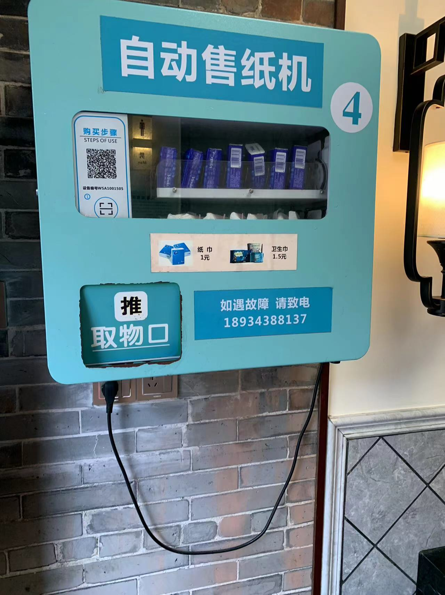

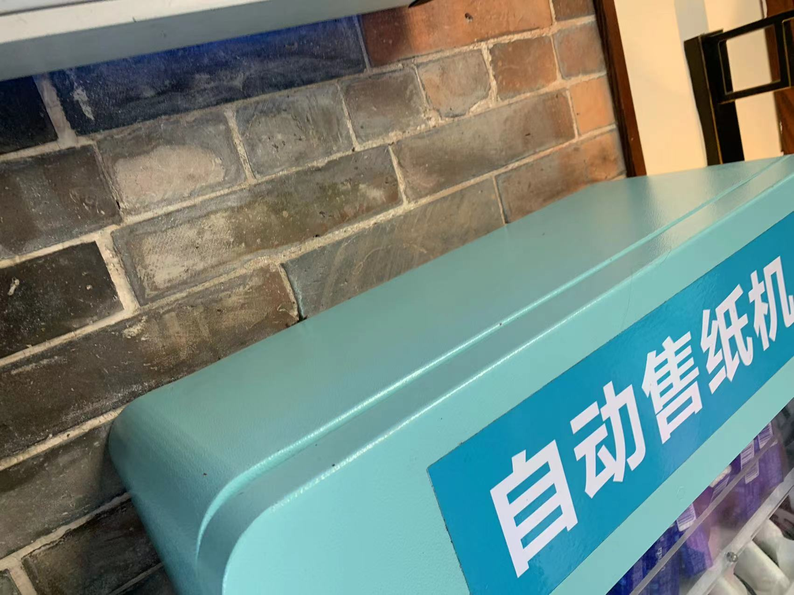


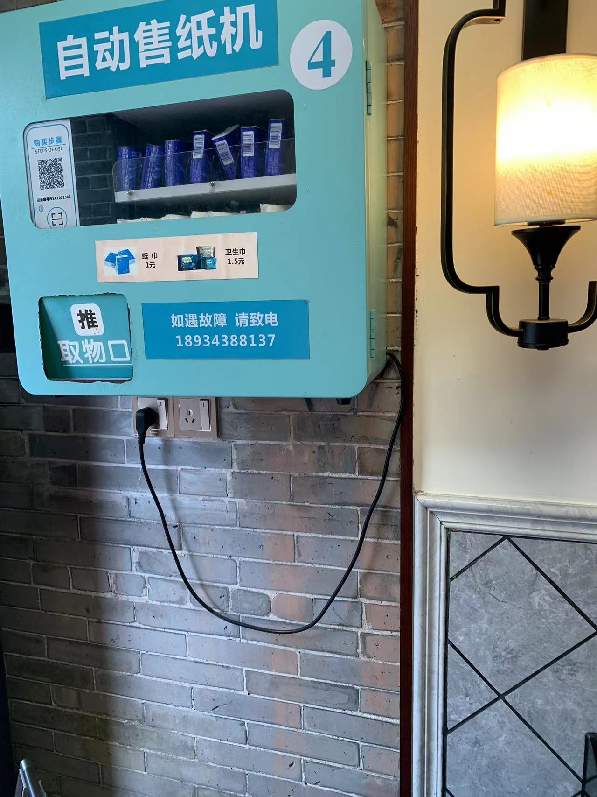
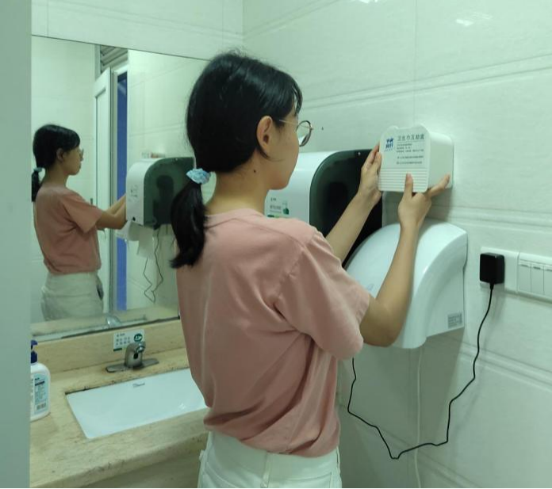
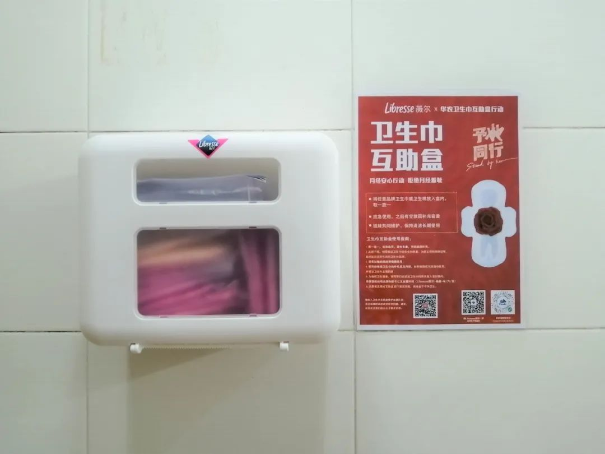

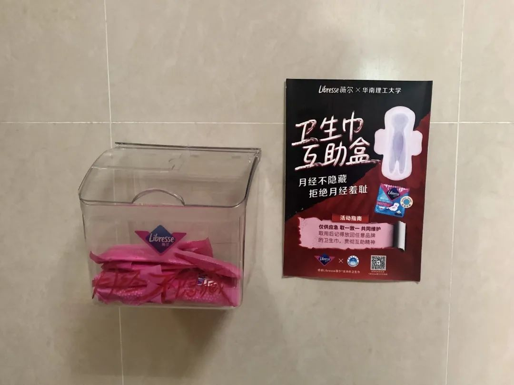


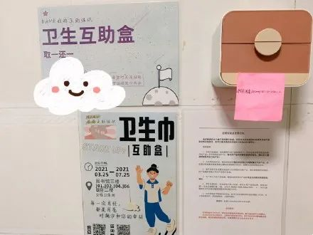
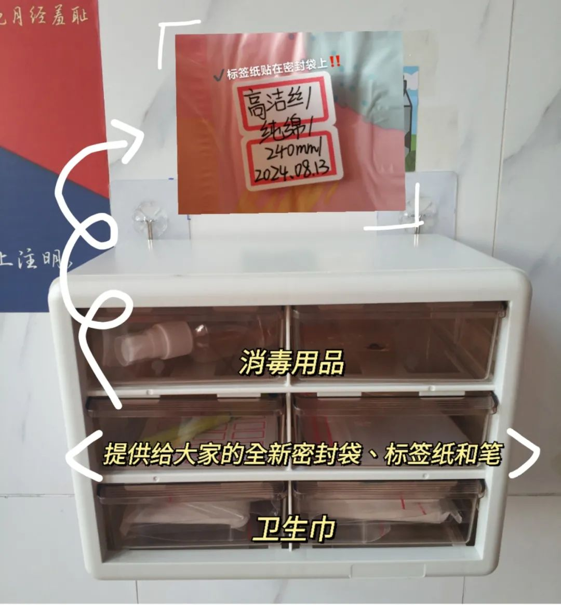
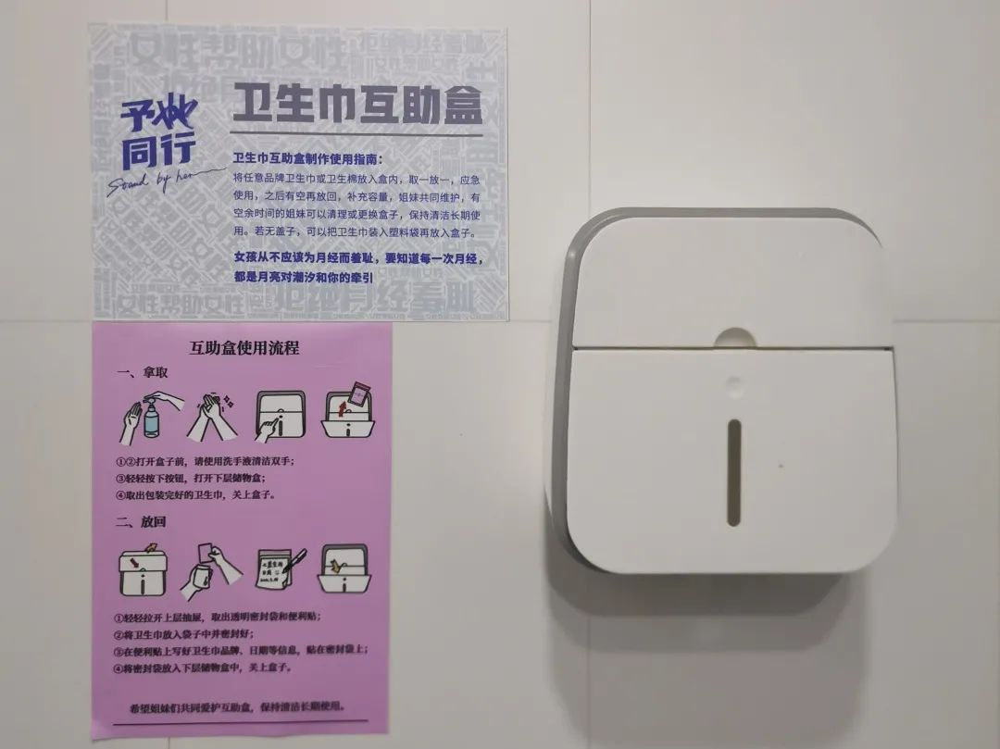
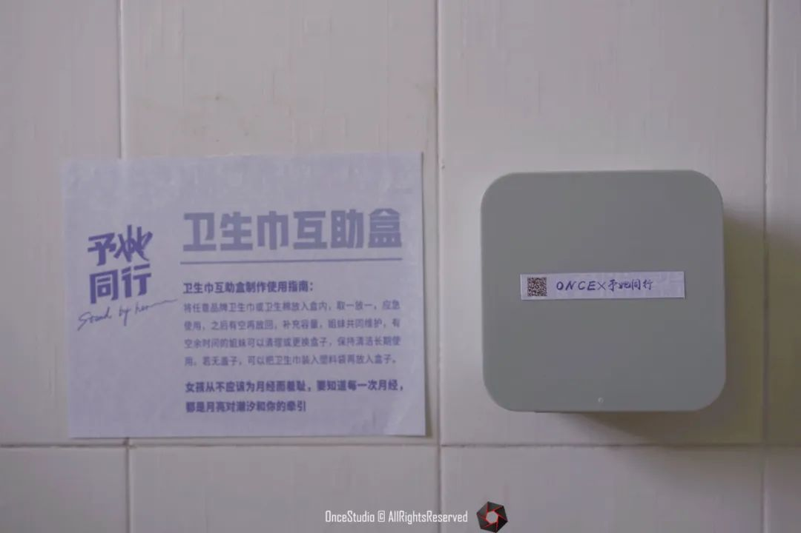

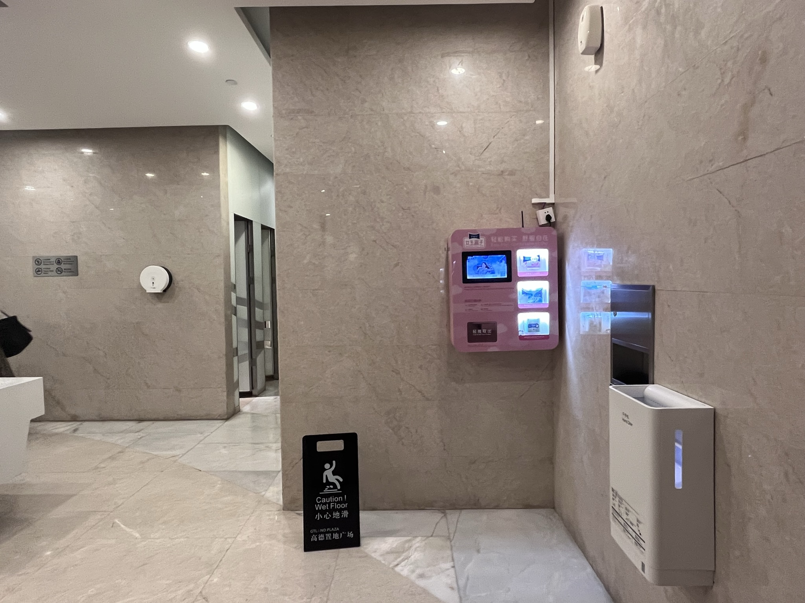
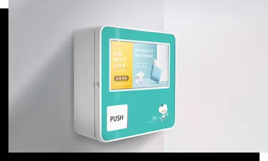
``

</div>
```

## Survey Result Interpretation

Our survey received 62 responses with a diverse distribution across academic levels and staff. The majority of respondents prefer buying sanitary pads online (85%), with supermarkets and convenience stores also being popular (56%). This indicates a potential early adopter customer base for offline purchases.

Regarding budget preferences, 40% spend 1-2 RMB per pad, and 39% spend 2-3 RMB. Only 10% spend below 1 RMB, suggesting period poverty is not a significant issue on campus.

<figure style="text-align: center;">
    
    <figcaption style="margin-top: 10px;">Budget per sanitary pad piece at HKUST(Guangzhou).</figcaption>
</figure>

Brand loyalty is notable, with over 83% considering the brand important. Top brands include Kao Laurier, Kotex, P&G Whisper, and Sofy. Quality is the most important factor for 84% of respondents, suggesting a need for high-quality products in our initiative.

<figure style="text-align: center;">
    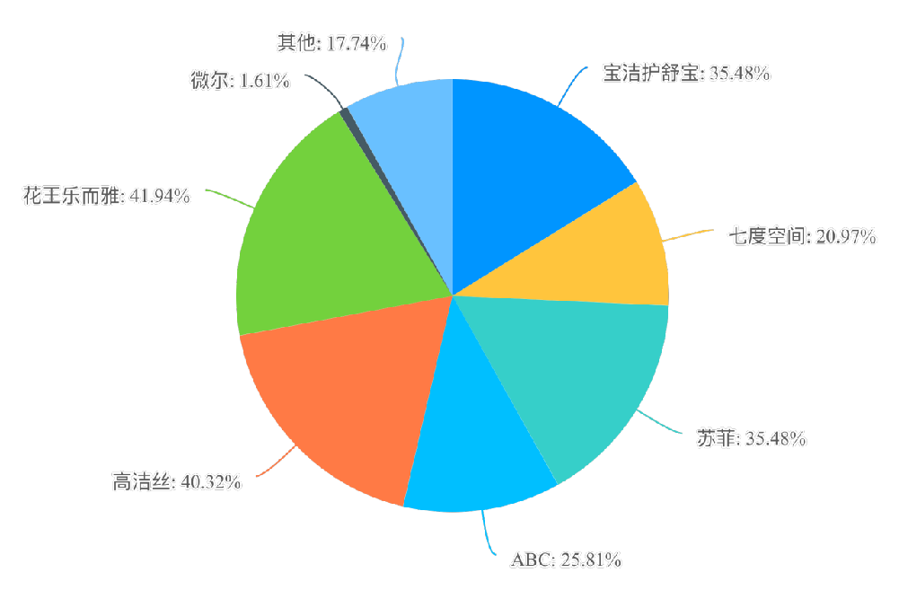
    <figcaption style="margin-top: 10px;">Sanitary pad brand preference at HKUST(Guangzhou).</figcaption>
</figure>


Only 6% prioritize the convenience of purchase location, indicating limited necessity for multiple campus stations. Interest in additional products like cleaning items, disposable underwear, and snacks was also noted.

## Comparative Study - International Perspective

Comparatively, in 2021, proposals were made to the Chinese government regarding menstrual health policies, but they were not sponsored. Internationally, Scotland offers free menstrual supplies, India abolished tax on sanitary products, and Korea initiated free distribution in public areas.

## Free Menstrual Supplies in Various Countries

| Free in All Public Areas                                       | No Tax         | Free in Specific Regions or Public Areas                                      |
|----------------------------------------------------------------|----------------|-------------------------------------------------------------------------------|
| Scotland (community centers, youth clubs, pharmacies, etc.)    | India          | New Zealand (schools)                                                         |
|                                                                | Kenya          | Australia (schools in New South Wales and Victoria)                          |
|                                                                | South Africa   | USA (schools in Illinois, Washington, New York, New Hampshire, Virginia)     |
|                                                                |                | France (schools in Île-de-France)                                             |
|                                                                |                | Kenya (schools)                                                               |
|                                                                |                | South Africa (schools)                                                        |
|                                                                |                | Botswana (schools)                                                            |
|                                                                |                | Korea (public areas, e.g., library in Central Seoul)                          |
|                                                                |                | Uganda (schools)                                                              |
|                                                                |                | Zambia (rural schools)                                                        |
|                                                                |                | Canada (schools and federal agencies in British Columbia, Ontario, Nova Scotia, Prince Edward Island) |

_Table: Summary of Countries and Regions Providing Free Menstrual Supplies._

## Limitations

### Survey Design
Our survey design has limitations that might introduce bias. The framing of questions can lead to skewed results, and the absence of certain options may influence respondents' choices. Additionally, acquiescence bias is a concern, particularly in questions about personal habits and preferences.

### Vending Machine IoT System
We have consulted PhD professionals in IoT and an expert. The interaction flowchart of the vending machine IoT System is as shown below.

[IOT System Demo](https://hkustgz-my.sharepoint.com/:v:/g/personal/mgong081_connect_hkust-gz_edu_cn/EY7chR4BbPhNltFOrgyMpqIBCfkH22MX90KZ3F_L2zHr4g?e=EUZFZ6)

<figure style="text-align: center;">
    
    <figcaption style="margin-top: 10px;">Interaction flowchart between Vending Machine and IoT System.</figcaption>
</figure>

The process can be concluded as follows: After each sale of goods, vending machines report the type, quantity, time, and region of the sold goods to the Internet of Things platform. The Internet of Things platform provides rule engine capabilities, supporting the forwarding of data reported to other cloud services such as Huawei Cloud. It can achieve the forwarding of massive data to MapReduce Service (MRS) through Data Ingestion Service (DIS), After processing the data, it is read and presented as a visual report by the Data Lake Visualization (DLV), achieving one-stop data collection, processing, and analysis.
# Conclusion

Our project combined teamwork, innovative thinking, and effective resource utilization to address the availability of sanitary pads. Key accomplishments include:

- Development of an IoT vending machine prototype for emergency feminine product stations.
- Creation of a data visualization website to analyze sanitary pad stations in Guangdong.
- Establishment of a rating system and execution of a survey to facilitate campus implementation.
- Proposal of policy recommendations aimed at tackling menstrual stigma and poverty.

These initiatives are pivotal in promoting an inclusive and progressive environment in educational institutions, directly benefiting students and staff. Furthermore, they contribute to broader societal advancements in menstrual health and gender equality.

# Future Work

## Sustainable Vending Machine
We are developing a solar-powered off-grid vending machine. The main components include solar panels, charge controllers, batteries, and inverters. For a small 15W vending machine, we need a 300W solar power system and 160 Ah batteries.

```{=html}
<div style="text-align: center;">
    <figure style="display: inline-block; margin-right: 20px;">
        
        <figcaption style="margin-top: 10px;">The schematic diagram of the solar off-grid power generation system.</figcaption>
    </figure>

    <figure style="display: inline-block;">
        
        <figcaption style="margin-top: 10px;">The structure of the solar panel.</figcaption>
    </figure>
</div>
```

## Leveraging Online Suppliers & Lowering Costs
We aim to partner with online platforms for discounts and special offers, and implement programs to provide free or subsidized sanitary products to students in need.

## Sustainable Design & Environmental Awareness
Our focus includes promoting sustainable menstrual products and raising awareness about environmental impacts. We're exploring collaborations to potentially make sanitary napkins recyclable and considering the addition of solar panels to vending machines.

## Health and Hygiene Education
We plan to organize workshops on menstrual health and hygiene, including sustainable practices and proper disposal methods, to raise awareness about women's rights.

## Managing Conflicts of Interest
Future steps include:
1. **Transparent Procurement Processes:** Ensuring transparency in sanitary product procurement.
2. **Diverse Committee Involvement:** Forming a diverse committee to oversee sanitary initiatives and review potential conflicts of interest.
3. **Regular Audits and Reviews:** Conducting audits to ensure the effective and transparent use of funds.

## Upholding University Image
We aim to:
1. **Positive Communication Strategy:** Highlighting the university's commitment to sustainability and gender inclusivity.
2. **Community Engagement:** Involving the university community in decision-making processes.
3. **Collaboration with External Organizations:** Partnering with organizations focused on menstrual health and gender equality.
4. **Regular Updates and Reporting:** Providing updates on initiatives and improvements.

## Legislation Recommendations
We plan to expand our project to schools and promote policies for including sanitary napkins in medical insurance and reducing taxes on feminine hygiene products. We will seek advocacy from members of the National People’s Congress and collaborate with others to mandate the delivery of sanitary napkins in public places.


# References

[1] “卫生巾互助盒在华农‘出圈’！发起人是一名大二女生……_腾讯新闻.” Accessed: Nov. 27, 2023. [Online]. Available: https://new.qq.com/rain/a/20210315A0E2YJ00#tdsub

[2] 雁阵君, “予她同行｜卫生巾互助盒试点计划来啦！,” Weixin Official Accounts Platform. Accessed: Nov. 27, 2023. [Online]. Available: http://mp.weixin.qq.com/s?__biz=MjM5Mjc2MzU5NQ==&mid=2653275915&idx=1&sn=bd5728a5a9605387a4180041895a784d&chksm=bd703caf8a07b5b9a6881b19fbdfd039ebce8fd731c61bfff040d5c8881e2c8b9ad17793d6f6#rd

[3] 百步梯新媒体部, “聚焦 | 卫生巾互助盒：代表月亮守护你,” Weixin Official Accounts Platform. Accessed: Nov. 27, 2023. [Online]. Available: http://mp.weixin.qq.com/s?__biz=MjM5NDA4NzM4MA==&mid=2650670461&idx=2&sn=09899ad595102025adc55d305a2752fb&chksm=be878dc689f004d0f7c4fa7125678199649920964807ad611b7d11cd5ea9de4279672ca26759#rd

[4] “广东高校掀起‘卫生巾互助盒’浪潮，反对月经羞耻！,” Weixin Official Accounts Platform. Accessed: Nov. 27, 2023. [Online]. Available: http://mp.weixin.qq.com/s?__biz=MzIxMzA5MTI4NQ==&mid=2653461150&idx=3&sn=538a6baab1cfc4cbb29fc7ed14f026e4&chksm=8c602c24bb17a532ec3912eb7e9a4aee06f9dc53ad854d43270bb2322e835b9e49533c2b7871#rd

[5] 不止休耻girls, “【华农招新季】卫生巾互助这件事，我们是认真在做！,” Weixin Official Accounts Platform. Accessed: Nov. 27, 2023. [Online]. Available: http://mp.weixin.qq.com/s?__biz=MzI5NDkxNTE0OA==&mid=2247484981&idx=1&sn=18c970bce3a5cd1a85a0e53a30baa686&chksm=ec5adb16db2d5200e9bed2cc90cc6ed2586edd9124d6ec7dfebdf9e40e045a33140bbf6e2f7c#rd

[6] “卫生巾互助盒的故事 | #No Period Shame#,” Weixin Official Accounts Platform. Accessed: Nov. 27, 2023. [Online]. Available: http://mp.weixin.qq.com/s?__biz=MzU1NjU2NzE2OQ==&mid=2247486177&idx=1&sn=f3e5693c8818548a796ff60de4969022&chksm=fbc2550fccb5dc19adb92e414653d9b8962a1d885d0ff41863507d4d2131110fae1dd83fb743#rd

[7] 钟雯, “高校卫生巾互助盒行动｜谁在行动？,” Weixin Official Accounts Platform. Accessed: Nov. 27, 2023. [Online]. Available: http://mp.weixin.qq.com/s?__biz=Mzg2MDAzNjExOA==&mid=2247483689&idx=1&sn=e49a3b468fd09b4dd8ddc2f970a18500&chksm=ce2dcc50f95a454667de92388b04b2b1522f55dfca60b71312758e3db5c959c5266e800ffe57#rd

[8] “予她同行|让她不再束手无策,” Weixin Official Accounts Platform. Accessed: Nov. 27, 2023. [Online]. Available: http://mp.weixin.qq.com/s?__biz=MjM5ODk5MTcyNA==&mid=2649176032&idx=1&sn=27dcd5791c6373f7209d98d81ab444d8&chksm=bed1d5e389a65cf5f438eb2e880f43f4d5fb3c072795ffb804e358e1b0df04cc930813d6f786#rd

[9] 积极建设广科的, “卫生巾互助盒？二手交易平台？这些提案有点东西,” Weixin Official Accounts Platform. Accessed: Nov. 27, 2023. [Online]. Available: http://mp.weixin.qq.com/s?__biz=MzU5ODEzODg2NQ==&mid=2247496665&idx=1&sn=b000fbc724c55ff7cb577f97b6fe50b7&chksm=fe4a7947c93df051bae6389708627b4f31ff56b301f9f42a20ba9bf6924fdd6e86e189601866#rd

[10] MCU, “卫生巾互助盒在广药的这一年,” Weixin Official Accounts Platform. Accessed: Nov. 27, 2023. [Online]. Available: http://mp.weixin.qq.com/s?__biz=Mzg3MjU0NDg2Ng==&mid=2247484086&idx=1&sn=c0ff4cd2258b1e998ce04755b90dc981&chksm=ceecedbbf99b64ade46bc0519b0a7be305d64eddbee52270d1be8e5544a798832a1eaab89ef2#rd

[11] “Weixin Official Accounts Platform.” Accessed: Nov. 27, 2023. [Online]. Available: https://mp.weixin.qq.com/s/oS10sAuQr9KNenbhuCd89A#tdsub

[12] “飞么FAIMES官网__精致女人用飞么.” Accessed: Nov. 27, 2023. [Online]. Available: https://faimes.net/

[13] 月事骄傲, “联合发声 | 关于‘月经’，我想为妇女儿童发展纲要建言,” 微信公众平台. Accessed: Nov. 27, 2023. [Online]. Available: http://mp.weixin.qq.com/s?__biz=Mzk0NjEyNzY0OA==&mid=2247483683&idx=1&sn=2b264f2c1e1b03dcd8ad5fc8197c12c8&chksm=c30b976cf47c1e7aa44f5ac55db5f5a9c4bcdd9578745459ccb6c1f8ab06553a3b2b56dc4be8#rd

[14] “20 Places Around the World Where Governments Provide Free Period Products,” Global Citizen. Accessed: Nov. 27, 2023. [Online]. Available: https://www.globalcitizen.org/en/content/free-period-products-countries-cities-worldwide/

[15] “财政部答复代表提出的‘减免卫生巾增值税’‘将卫生巾费用纳入医社保’等问题_婴童品牌网.” Accessed: Nov. 27, 2023. [Online]. Available: http://www.ytpp.com.cn/data/2021-08-31/95791.html#tdsub

[16] 马娟, “国务院办公厅关于印发国家贫困地区儿童发展规划（2014—2020年）的通知_妇女儿童_中国政府网.” Accessed: Nov. 27, 2023. [Online]. Available: https://www.gov.cn/zhengce/content/2015-01/15/content_9398.htm#tdsub